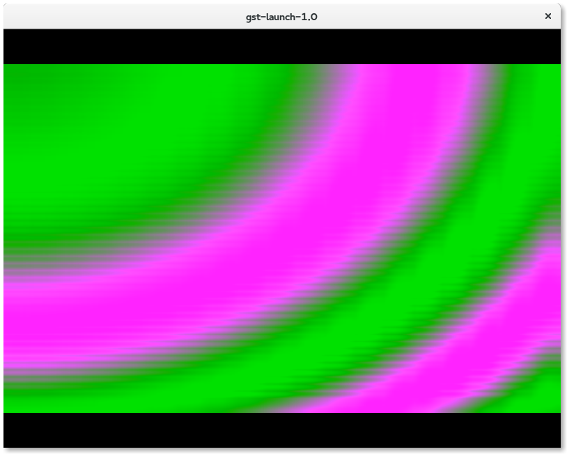
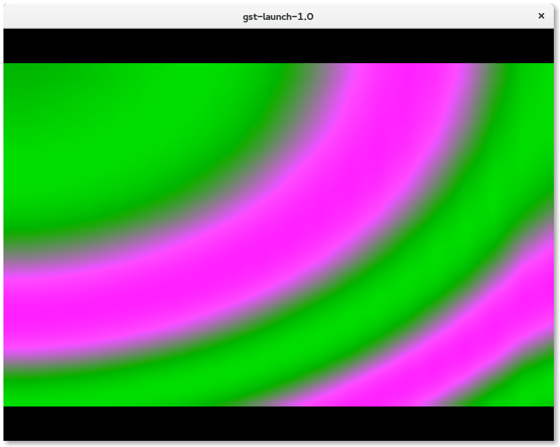
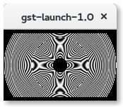
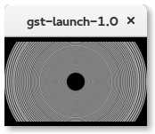
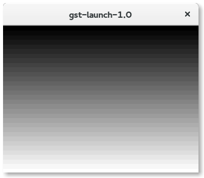
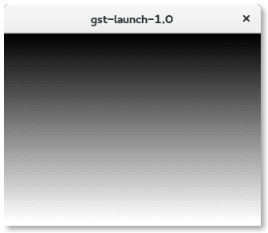
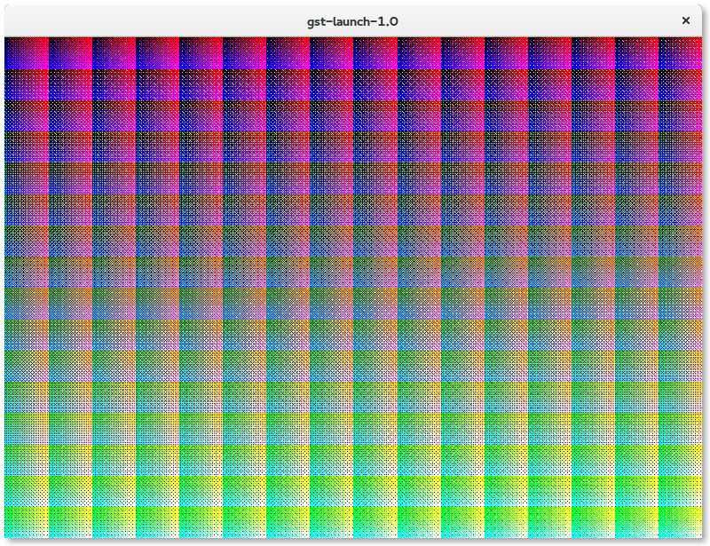
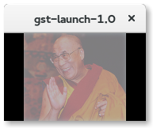
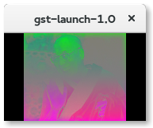
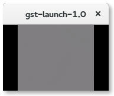

# GStreamer 1.6 Release Notes

The GStreamer team is proud to announce a new major feature release in the
stable 1.x API series of your favourite cross-platform multimedia framework!

This release has been in the works for more than a year and is packed with
new features, bug fixes and other improvements.

See
[http://gstreamer.freedesktop.org/releases/1.6/](http://gstreamer.freedesktop.org/releases/1.6/)
for the latest version of this document.

## Highlights

- Stereoscopic 3D and multiview video support
- Trick mode API for key-frame only fast-forward/fast-reverse playback etc.
- Improved DTS (decoding timestamp) vs. PTS (presentation timestamp) handling
  to account for negative DTS
- New GstVideoConverter API for more optimised and more correct conversion of
  raw video frames between all supported formats, with rescaling
- v4l2src now supports renegotiation
- v4l2transform can now do scaling
- V4L2 Element now report Colorimetry properly
- Easier chunked recording of MP4, Matroska, Ogg, MPEG-TS: new splitmuxsink
  and multifilesink improvements
- Content Protection signalling API and Common Encryption (CENC) support for
  DASH/MP4
- Many adaptive streaming (DASH, HLS and MSS) improvements
- New PTP and NTP network client clocks and better remote clock tracking
  stability
- High-quality text subtitle overlay at display resolutions with glimagesink
  or gtkglsink
- RECORD support for the GStreamer RTSP Server
- Retransmissions (RTX) support in RTSP server and client
- RTSP seeking support in client and server has been fixed
- RTCP scheduling improvements and reduced size RTCP support
- MP4/MOV muxer acquired a new "robust" mode of operation which attempts to
  keep the output file in a valid state at all times
- Live mixing support in aggregator, audiomixer and compositor was improved a
  lot
- compositor now also supports rescaling of inputs streams on the fly
- New audiointerleave element with proper input synchronisation and live input
  support
- Blackmagic Design DeckLink capture and playback card support was rewritten
  from scratch; 2k/4k support; mode sensing
- KLV metadata support in RTP and MPEG-TS
- H.265 video encoder (x265), decoders (libav, libde265) and RTP payloader and
  depayloaders
- New DTLS plugin and SRTP/DTLS support
- OpenGL3 support, multiple contexts and context propagation, 3D video,
  transfer/conversion separation, subtitle blending
- New OpenGL-based QML video sink, Gtk GL video sink, CoreAnimation
  CAOpenGLLayerSink video sink
- gst-libav switched to ffmpeg as libav-provider, gains support for
  3D/multiview video, trick modes, and the CAVS codec
- GstHarness API for unit tests
- gst-editing-services got a completely new ges-launch-1.0 interface, improved
  mixing support and integration into gst-validate
- gnonlin has been deprecated in favor of nle (Non Linear Engine) in
  gst-editing-services
- gst-validate has a new plugin system, an extensive default testsuite,
  support for concurrent test runs and valgrind support
- cerbero build tool for SDK binary packages gains new 'bundle-source' command
- Various improvements to the Android, iOS, OS X and Windows platform support

## Major new features and changes

### Stereoscopic 3D video support

The infrastructure required for handling stereoscopic and multiview
content has been implemented.  This includes necessary API additions
to the GstVideo library along with additional optional caps fields signifying
the multiview layout of one or more video frames.  Check out
[http://cgit.freedesktop.org/gstreamer/gst-plugins-base/tree/docs/design/part-stereo-multiview-video.markdown](http://cgit.freedesktop.org/gstreamer/gst-plugins-base/tree/docs/design/part-stereo-multiview-video.markdown)
for the design details.

A number of demuxers and decoders were updated to propagate the necessary
information if present inside the stream.  Unfortunately this is not always the
case for random files one pulls off the internet so properties were added to
playbin for applications to utilise in order to override how the video frame is
interpreted for display or further manipulation.

Some 3D elements were also created using GStreamer's OpenGL framework to
split and merge 3D streams as well as convert between the numerous packings that
are available.  These element are glstereosplit, glstereomix and glviewconvert
respectively.

h264parse will detect SEI FPA (frame packing arrangement) markers,
and x264enc will insert them automatically for stereoscopic input
or when forced to do so via the new "frame-packing" property.

The gst-plugins-bad source tree contains a little [3dvideo demo application](http://cgit.freedesktop.org/gstreamer/gst-plugins-bad/tree/tests/examples/gl/gtk/3dvideo)
for those itching to play around with it.

Still to come is integrating the GStreamer support with players and the
display subsystems for configuring the output onto 3D displays.

### Trick mode API and improved trick mode support

Trick modes, that is fast-forward, fast-reverse and normal-speed reverse
playback, have been supported in GStreamer for a long time, but the 1.6
release adds improved support for it in various plugins as well as some
new API for configuring trick-mode playback.

New API was introduced to select decoding of keyframes only, or disabling of
audio. For much-faster-than-realtime playback this reduces the required
processing power and especially makes it possible to reach higher playback
rates on embedded devices.

Support for this new API was added to the gst-libavvideo decoders and the
MP4/QuickTime (qtdemux) demuxer. For the latter this also greatly reduces the
input data bandwidth, as the demuxer now can skip over data that is not
required.

Audio decoders will automatically skip decoding if trick mode playback without
audio has been requested (only in fast-forward mode so far), and send GAP
events instead of decoded audio.

Support for reverse playback is now implemented for stand-alone audio files,
e.g. MP3, FLAC and AAC, which are not wrapped in a container like MP4 or
Matroska.

### Improved DTS (decoding time stamp) vs. PTS (presentation time) handling to account for negative DTS

Streams with initially negative DTS are now properly handled by most muxers
and demuxers. As GStreamer timestamps are positive value, GstSegment offset
has been implemented to represent these negative values by simply pushing
forward the timestamp.

This came with new APIs. Notably gst_segment_to_running_time_full() was added
to allow to get the running time of a timestamp that is outside the segment
boundary. There is also gst_video_encoder_set_min_pts() which makes it easy
for encoders to shift forward the segment and avoid negative values.
The GstCollectData type of GstCollectPads has been extended to hold a gint64
copy of the running time DTS so muxers can account for it. Note that the
x265enc H265 encoder is not fixed in this release. This will likely happen in
a minor release update later.

### video library improvements

A generic video conversion function was added to the video library. This
function performs internally what videoconvert and videoscale used to do
along with some nice new enhancements.

While the code of the 1.4 videoconvert element was moved into this new converter
library without many changes, the **videoscale code was completely rewritten
from scratch to allow more optimizations and more kernels**.

#### scaling is now supported between all formats

The 1.4 videoscaler only supported a couple of formats and when using the
lanczos filter, even less. The new scaler uses the video pack/unpack functions
to handle all supported formats.
 
This has the nice advantage that you can remove 1 or two colorconvert elements
before and/or after the scaler, which should improve performance. Take a look
at how we would scale 10000 buffers in the NV21 format:
 
     1.6:  gst-launch-1.0 videotestsrc num-buffers=10000 ! \
              video/x-raw,format=NV21,width=80,height=50 ! \
              videoscale ! \
              video/x-raw,format=NV21,width=800,height=500 ! \
              fakesink
           Execution ended after 0:00:01.803369242

     1.4: gst-launch-1.0 videotestsrc num-buffers=10000 ! \
             video/x-raw,format=NV21,width=80,height=50 ! \
             videoconvert ! videoscale ! videoconvert ! \
             video/x-raw,format=NV21,width=800,height=500 ! \
             fakesink
           Execution ended after 0:00:05.409629982

Or try just this line in 1.4 and 1.6:

     gst-launch-1.0 videotestsrc num-buffers=10000 ! \
         video/x-raw,format=YUV9,width=80,height=50 ! \
         videoconvert ! videoscale ! videoconvert ! \
         video/x-raw,format=YUV9,width=800,height=500 ! \
         fakesink
     
     1.4: Execution ended after 0:00:12.663300459
     1.6: Execution ended after 0:00:01.537649756

Thats more than 8 times faster just because we can avoid conversions.

#### many more scaling algorithms

The 1.4 video scaler supported nearest, bilinear, 4-tap sinc and n-tap lanczos
resampling. The 4-tap scaler had some trouble with certain scaling operations
(bugs?) that were fixed. Compare the output between 1.4 and 1.6 for this
gst-launch line:
 
     gst-launch-1.0 videotestsrc kx=4 ky=6 kx2=4 ky2=5  pattern=16 ! \
            video/x-raw,format=Y41B,width=80,height=50 ! \
            videoscale method=2 ! \
            video/x-raw,width=800,height=600 ! \
            videoconvert ! ximagesink
        

A new scaler algorithm based on cubic interpolation has been added. This scaler
can be configured with 2 parameters and there are some common configurations
available as defaults. This adds support for some common scaling filters such
as Hermite, Spline, Catmull-Rom, Mitchell and Robidoux.
 
All of the scalers can be configured for an unlimited amount of taps. By
default the number of taps is based on the input vs output size but this can
be manually selected as well. Using more taps for downscaling is common,
compare the output of the these lines:
 
     1.4: gst-launch-1.0 videotestsrc pattern=11 ! \
              video/x-raw,width=1920,height=1080 ! \
              videoscale method=1 ! \
              video/x-raw,width=160,height=100 ! \
              ximagesink

     1.6: gst-launch-1.0 videotestsrc pattern=11 ! \
              video/x-raw,width=1920,height=1080 ! \
              videoscale method=4 ! \
              video/x-raw,width=160,height=100 ! \
              ximagesink

Both are using linear interpolation but the 1.6 version can use more than 2
taps to create a much smoother output image.

The lanczos scaler is also no longer experimental in 1.6 and works correctly
in all cases now.
 
#### many scaling optimizations

In 1.4, nearest and linear had some ORC optimizations for some formats. In 1.6
there are ORC optimizations for all formats and all scaling algorithms. All
scaling operations with 4 or more taps are much faster than before.
 
Compare this pipeline:
 
     gst-launch-1.0 videotestsrc ! \
           video/x-raw,width=1920,height=1080 ! \
           imagefreeze !  \
           videoscale method=3 ! \
           video/x-raw,width=160,height=100 ! \
           fakesink num-buffers=1000
       
      1.4: Execution ended after 0:00:09.526412358
      1.6: Execution ended after 0:00:01.146192227

The video converter will now also be smarter about selecting whether to first
scale in the horizontal or vertical direction. This can be quite a performance
improvement when changing the aspect ratio.

#### ORC optimizations for some chroma resampling

The chroma resampler also saw some ORC optimizations for some up and
downsampling operations, singifincantly speeding up those operations.
 
The video scaler can perform chroma-up/downsampling and scaling in one
operation in some cases.

#### quantization with various dithering algorithms

Support was added for configurable quantization and dithering. When going from
a high bit depth to a lower bit depth, it is recommended to perform some sort
of dithering to avoid color banding. The most common case is when converting
an image with 24 bits per pixel to 16 bits per pixel. The Ultra-HD standard
also defines a 10bit per component format that should ideally be dithered
before converting to an 8bit per component format typically used for display.
  
Compare the output of the following pipelines in 1.6:
 
     gst-launch-1.0 videotestsrc pattern=23 ! \
            video/x-raw,format=RGB ! \
            videoconvert dither=0 ! \
            video/x-raw,format=RGB15 ! \
            videoconvert ! ximagesink 

     gst-launch-1.0 videotestsrc pattern=23 ! \
            video/x-raw,format=RGB ! \
            videoconvert dither=4 ! \
            video/x-raw,format=RGB15 ! \
            videoconvert ! ximagesink 

 
We can also set a quantization factor in videoconvert that allows us to do
nice color effects:
 
     gst-launch-1.0 videotestsrc pattern=24 ! \
            video/x-raw,format=RGB ! \
            videoconvert dither=4 dither-quantization=256 ! \
            ximagesink

[//]: # (FIXME: perhaps add the original image before quanization for comparison)

Which quantizes the components to 1 bit and uses bayer dithering to create
intermediate colors. This can also be applied to video for some nice effects.
 
#### gamma corrected scaling

The video converter can now optionaly apply gamma correction before scaling
and colorspace conversion. Theoretically, scaling and color conversion should
be performed on linear light for optimal results but for performance reasons
this is often ignored.
 
Compare the output of these 3 lines on a specially crafted png:
 
     1.6:  gst-launch-1.0 http://gstreamer.freedesktop.org/media/small/gamma_dalai_lama_gray.png ! \
                 pngdec ! imagefreeze ! \
                 videoscale gamma-decode=1 ! \
                 video/x-raw,width=179,height=111 ! videoconvert ! ximagesink
   

     1.4:  gst-launch-1.0 http://gstreamer.freedesktop.org/media/small/gamma_dalai_lama_gray.png ! \
                 pngdec ! imagefreeze ! \
                 videoscale ! \
                 video/x-raw,width=179,height=111 ! videoconvert ! ximagesink
             

     1.6: gst-launch-1.0 http://gstreamer.freedesktop.org/media/small/gamma_dalai_lama_gray.png ! \
                 pngdec ! imagefreeze ! \
                 videoscale ! \
                 video/x-raw,width=179,height=111 ! videoconvert ! ximagesink
             

 
The color bands on the 1.4 image are caused by inaccurate scaling coefficients.
 
Gamma decoding requires the scaling and color conversion to be done in a
higher bit depth and stops us from combining the YUV to RGB and color
conversion matrices in one operation. It is therefore much more expensive and
is therefore disabled by default.
 
#### support for borders, crop and alpha

While performing conversion and scaling, the image can be padded with borders
or cropped. When the output image has alpha, you can choose to set the alpha to
a fixed value or copy the alpha (if the input has alpha). It's also possible to
multiply the input alpha with a fixed value and copy that in the output.
 
This makes it possible to replace the code in at least videocrop, videobox and
videoscale with the new converter. Some of the functionality of the alpha
element can also be implemented.
 
#### new rewritten conversion core
 
The newly rewritten conversion core operates on scanlines to maximize cache
locality and would allow us to run the conversion in multiple threads later.
 
Currently the implemented conversion steps contain:
 
1) unpack: convert the input packing to a cannonical intermediate form such as ARGB or AYUV

2) upsample-chrome: perform chroma upsampling, for subsampled chroma this will interpolate
   the missing chroma
   
3) convert to RGB: this transforms Y'CbCr into R'G'B' using the input color
             matrix.
             
4) gamma decode: transform the non-linear RGB (R'G'B') to linear RGB

5) do downscaling: perform all reductions in image size. This is done first
             to make the following steps operate on less pixels
             
6) convert between colorspaces: converts between the different RGB
             colorspaces. The different colorspaces are connected to eachother
             using the CIE XYZ colorspace.
             
7) do alpha channels: adds and aplha channel or copy/multiple the input alpha
             with a constant alpha.
             
8) do all upscaling: perform all image upscaling

9) gamma encode: gamma encode from RGB to R'G'B

10) convert to Y'CbCr: convert R'G'B' to Y'CbCr using the output color matrix.

11) downsample-chroma: Perform chroma downsampling

12) do dithering: perform dithering to the target depth using the selected
             dithering algorithm
             
13) pack: convert to the final output packing

Depending on the options that are selected, many of these steps can be merged
into a single step, such as 3), 6) and 10); when there is no scaling or gamma
correction, these 3 matrix multiplications are merged into 1.

Many specialized functions exist and optimizations are done to minimize the
number of steps need to perform a conversion.

#### video: miscellaneous

- Support for BT2020 (UHD) colorspace
- support for more video formats: NV61
- text and logo overlay blending improvements and optimisations
- unhandled navigation events (key strokes, clicks, pointer movements) can
  now be posted on the bus as messages for the application to handle

### video4linux: renegotiation support and improvements

V4L2 source can now renegotiate its format without restarting the pipeline.

To do that, the element will request and wait for the pipeline to return all
buffers to its bufferpool. After that, it can destroy it, set a new
format to the device and then create a new bufferpool, allowing it to restart
capturing using the new requested format and resolution. With this feature,
an application can now switch the resolution at run-time, without having to
stop the source.

Support for colorimetry has been added. This enables correct colors to be
displayed.
More Bayer formats are now supported along with many stability fixes all over
the shared V4L2 code.

### Easier chunked recording of MP4, Matroska, Ogg, MPEG-TS: new splitmuxsink and multifilesink improvements

When recording a stream one often wants to regularly split the recorded files
into smaller chunks instead of having one very large output file. This might
be in order to avoid filesystem limitations (e.g. 2GB limit on FAT32), to make
the output more managable, or simply because the recording never ends
(such as with CCTV security feeds).

multifilesink can also be made aware of GOPs using the new 'aggregate-gops'
property and will ensure GOPs aren't split accross files. Together with the
'max-size' and 'max-duration' modes it can be used to generate a sequence of
properly muxed files of the desired size. This only works for streaming formats
such as OGG or MPEG-TS; for non-streaming formats such as MP4 splitmuxsink
should be used.

### Content Protection signalling API and Common Encryption (CENC) support

GStreamer has gained a new generic API to signal content protection (DRM)
information between elements such as demuxers and decryptors. This API
is very generic and the details of how it is used varies depending on
the protection scheme used.

The new API consists of [protection events](http://gstreamer.freedesktop.org/data/doc/gstreamer/head/gstreamer/html/GstEvent.html#gst-event-new-protection)
for general setup information and a [protection meta](http://gstreamer.freedesktop.org/data/doc/gstreamer/head/gstreamer/html/gstreamer-GstProtectionMeta.html)
that can be attached to individual buffers with buffer/sample-specific information.

This new API was then used to implement support for DASH Common Encryption (CENC)
in dashdemux and qtdemux. This should also cover the Common File Format (CFF) which
is used e.g. by the UltraViolet format. PlayReady support is also in the pipeline.

It should be noted that GStreamer does not ship any elements to do the actual
decryption nor does it integrate with any DRM system, that is left to device
vendors and system integrators. It simply provides the infrastructure and
signalling now to make it easy to add such elements.

### Adaptive streaming: DASH, HLS and MSS improvements

HLS, DASH and Smooth Streaming support were majorly rewritten and now
share the same codebase, allowing easier maintenance and uniform
operation.

This new version is more robust and reliable than ever,
additionally covering more features from their individual
specifications.

Live playback support was improved, more profiles are
handled, some trick modes are supported, better report of network
statistics as well as connection reuse for faster downloads.

The GStreamer DASH client is now capable of handling common
encryption (CENC) if suitable decryption elements are present.

Clock synchronization between DASH client and server was also
improved: support was added for DASH UTCTime live-stream clock-drift
handling, including support for NTP variant, leading to claims that
"GStreamer now probably got the most complete clock drift implementation
of any DASH client".

As a result of this effort, DASH implementation is now capable of
playing the vast majority of the DASH Industry Forum test streams!
(And for the few issues that remain there are already patches in bugzilla.)

HLS, in specific, has a better timestamping in this version,
preventing some stalls, and also supports seeking in live streams
for the range of segments available in the server.

DASH also supports seeking in live streams now for the timeshift range
present in server.

### Clocks: improved network clock support: PTP, NTP and better clock tracking stability

GStreamer has had support for both providing and slaving to a remote network
clock for a very long time using the GetNetTimeProvider and GstNetClientClock
API, which implements a custom protocol to sync the clocks of multiple
pipelines and provide for synchronised capture or playback across multiple
devices.

The 1.6 release now adds support for network clocks based on the
[Precision Time Protocol (PTP)](https://en.wikipedia.org/wiki/Precision_Time_Protocol)
and the good old [NTP](https://en.wikipedia.org/wiki/Network_Time_Protocol)
protocol. These clocks can be set on a pipeline so that the pipeline is
slaved against an external time provider.

PTP is part of a few broadcasting and professional media standards, such as
AES67, RAVENNA, AVB, SMPTE ST 2059-2 and other inter-device synchronization
standards.

See Sebastian's blog post about [PTP network clock support in GStreamer]
(https://coaxion.net/blog/2015/05/ptp-network-clock-support-in-gstreamer/)
for more details.

All netclocks, including the existing net client clock, have much better
filtering for irregular measurements now, improving accuracy a lot. This
also helps keep multiple devices in sync when the time provider disappears
over longer periods of time, e.g. due to a network outage.

The netclocks can now also post statistic bus messages and discont limits
to a GstBus if requested.

New clock API:

- gst_clock_adjust_with_calibration()
- gst_clock_add_observation_unapplied()
- GST_CLOCK_FLAG_NEEDS_STARTUP_SYNC and related API

In the case of network clocks, it might take a while until these clocks
are properly synced up with the remote clock. Applications may want to wait
for those clocks to be in sync before using them. Such
clocks are flagged with the GST_CLOCK_FLAG_NEEDS_STARTUP_SYNC now, and
applications can wait for the clock to be in sync with
gst_clock_wait_for_sync() (this will block), check sync status with
gst_clock_is_synced(), or wait asynchronously for the "synced" signal
of the clock to be emitted.

### textoverlay and subtitle rendering improvements

textoverlay can now render subtitles in a resolution suitable for the
output window or surface when glimagesink or gtkglsink are used. So far
the resolution of the rendered text always depended on the resolution
of the video stream, which resulted in bad and pixelated text subtitles
for lower-resolution video streams.

Now the video sink window size is propagated upstream for better subtitle
quality and the subtitles can be rendered and displayed at a higher resolution
than the underlying video. This is implemented in glimagesink and gtkglsink
so far. This is currently limited to textoverlay, though we expect more
renderers to provide high resolution subtitles in the future.

textoverlay rendering code has also been partially re-written and now properly
calculate the text bounding boxes. This means, there will no longer be part of
your text clipped because you added a shadow or a larger outline.

### RTP/RTCP and RTSP improvements

GStreamer's RTP and RTSP stack saw numerous improvements during the 1.6
development cycle.

#### RTCP scheduling and reduced size RTCP

The RTP/RTCP session management now implements correct RTCP packet scheduling
according to RFC4585, which is especially noticeable in the cases of early
feedback reporting. This allows receivers to notify the sender about corrupted
data, missing packets or request keyframes even earlier than before, and
should improve the media transmission a lot in these situations.
Additionally support for reduced size RTCP receiving was implemented, which
allows feedback to be sent even more often. Sending support for this is
planned for the 1.8 release, with
[patches](https://bugzilla.gnome.org/show_bug.cgi?id=750332)
already available in Bugzilla.

This should also cause great improvements for WebRTC usage.

#### Retransmissions (RTX) support in RTSP server and client

The RTSP server and client both support RTP retransmissions (RTX) according
to RFC4588 now. In situations with packet loss this can allow the media
transport to mitigate the packet loss without affecting the quality of the
media.

This was previously supported in 1.4 for custom RTP usage, but this is now
automatically supported with RTSP. Additionally there were many bugfixes
related to retransmissions.

#### Inter-device synchronization over the network

Another noteworthy change is improvements to the support for inter-device
synchronization over the network. It is now possible, when using the GStreamer
RTSP server and client, to have all receivers perfectly synchronized to a
shared network clock with minimal effort from the application side. Example
applications can be found here:

- [test-netclock.c](http://cgit.freedesktop.org/gstreamer/gst-rtsp-server/tree/examples/test-netclock.c)
- [test-netclock-client.c](http://cgit.freedesktop.org/gstreamer/gst-rtsp-server/tree/examples/test-netclock-client.c)

This will be further improved during 1.8, with some patches already waiting in
Bugzilla.

#### GStreamer RTSP Server RECORD support

Usually RTSP servers serve media to be played back by the connecting client,
and that's a use case GStreamer's RTSP server has been handling well since
the very beginning.

The RTSP protocol also supports clients sending data to the server, however,
via the RECORD request, which is now also supported in the server. You can
find examples of how to use it in the example directory of the source tree.

#### Other changes

On the performance side, sending RTP media with GStreamer should be more
performant now with more widespread usage of buffer lists on the sending side
and sendmmsg() support in the UDP sink elements, but also lots of smaller
improvements everywhere.

Apart from that there were many other changes related to RTP and RTSP, for
example there is a H.265/HEVC payloader and depayloader now, support for the
ONVIF metadata RTP extension, support for SRTP/DTLS and in general lots of
robustness improvements and bugfixes all over the place.

#### RTSP Client and Server seeking

Seeking was only partially working for years using GStreamer RTSP client.
In 1.6, the seeking code has been reviewed and fixed. Notably, lost frame
issues has been addressed and playback position is now correctly reported.

### Robust MP4/MOV/QuickTime muxing

**MP4/MOV muxer acquired a new "robust" mode of operation which attempts to keep the output file in a valid state at all times**

Unlike streaming container formats, classic MP4/QuickTime files in the
non-fragmented variant are structured in such a way that if writing is
suddenly interrupted, the resulting files will be unreadable and the data
can not be easily recovered. Only once all headers and sample tables have
been written out at the very end can a player make sense of an MP4/MOV file.

GStreamer has had a way to deal with this problem for a long time in form of
the "moov-recovery-file" property that saves all the important header data to
a separate file in regular intervals. In case writing was interrupted, it
was then possible to recover the data using the qtmoovrecover element
which creates a new valid MP4 file from the written data and the saved
header data. This is rather cumbersome though and requires manual or
semi-manual intervention.

In this release, the MP4/MOV/QuickTime muxer elements (mp4mux, qtmux)
have acquired a new "robust" mode of operation which attempts to keep the
output file in a valid state at all times. This is achieved by reserving
some space for all the headers at the beginning of the file by setting the
"reserved-max-duration" property on the muxer. In fact it will reserve enough
space for *two* complete headers, and simply sets the references at the very
beginning of the file to point to one of the headers while it works on updating
the second header in the other reserved region. The interval for ping-ponging
the headers can be set using the "reserved-moov-update-period" property, and
the heuristics to estimate the disk space to reserve can be fine-tuned using
the "reserved-bytes-per-sec" property.

This mode requires that the downstream sink is seekable (such as filesink),
and the muxer will error out if that is not the case.

The implementation still leaves some room for optimisation - one could minimise
the bandwidth needed for updating the headers by only sending the data that
actually changed since the previous update, and structure the header tables
in such a way that the diffs will be minimal, but all of that is not
implemented yet.

It also makes certain assumption about how data will be written out
(no re-ordering for example), and that the new GST_BUFFER_FLAG_SYNC_AFTER
flag will be honoured.

### Live mixing and other improvements in aggregator, audiomixer and compositor

The GstAggregator base class that was introduced in 1.4 saw many improvements
since then. It is used currently by all (new) mixing elements for raw audio
and raw video: audiomixer, compositor, glvideomixer and the new
audiointerleave element. In the future it will also be used by muxers.

One of the biggest improvements since 1.4 is that GstAggregator has now
support for live mixing, something that was never supported well before in
GStreamer. In live pipelines, mixing now happens based on a deadline instead
of waiting until data for a specific output time is available. For live
pipelines, this ensures a guaranteed latency and especially that input streams
that have no data for a while will not take down the whole mixing process
until they have data again.

As part of this, it was also necessary to implement queueing on the sinkpads
of GstAggregator based elements to ensure that data is always available for
mixing and not blocked on previous elements and not arriving in time just
because of thread scheduler jitter.

During the implementation of the live mixing support, a few bugs in the
synchronization code in the base class and various elements was noticed and
fixed on the way. As a result the mixing should be much more optimal also
for non-live pipelines now.

With this, the liveadder element from gst-plugins-bad is deprecated and
audiomixer should be used instead.

#### Rescaling and conversion support in compositor

Compositor had had support for accepting raw video inputs in arbitrary formats
for a while (i.e. formats other than the negotiated output format), and
internally converts to the output format. This is required to avoid negotiation
and renegotiation races with multiple inputs.

It now also supports resizing of the input video streams on the fly thanks to
the new GstVideoConverter helper in the gstvideo library. Each input can now
be individually rescaled (and positioned) via pad properties.

#### New audiointerleave element

A new audiointerleave element was added, which shares a lot of code with
audiomixer. It does the same as the existing interleave element,
that is: it accepts multiple mono streams as input and converts them to
a multichannel output stream. Different to interleave, this element implements
proper synchronization. Synchronization was not implemented at all in the old
interleave element.

This situation is similar to audiomixer and adder, the latter having no
synchronization implemented at all. Both adder and interleave should not be
used in new code anymore.

### Blackmagic Design DeckLink capture and playback card support massively improved

- Split into separate audio/video elements instead of having a single element
  with two pads (this means it's usable in playbin now)
- Proper synchronization, including clock slaving with the hardware
  clock and allowing to use the hardware clock as pipeline clock
- Support for 2k and 4k modes
- Use hardware framerate adjustments instead of requiring videorate
- Mode autodetection in the sources
- Lots of bugfixes

The DeckLink capture and playback cards by Blackmagic Design are widely used
for audio/video signal capture and output (HDMI/SDI/etc.). GStreamer has had
support for these for a long time, but while it worked fine in general
it's never really been up to scratch for professional requirements and
many advanced use cases.

In this cycle the decklink plugin was completely rewritten. There are
now four instead of two elements: decklinkvideosrc, decklinkaudiosrc and
decklinkvideosink, decklinkaudiosink. Previously the audio and video
variant were a single element. As a side effect, it's possible to
use the sinks with playbin now, and it also allowed us to rebase these
elements on top of the standard GstBaseSrc/Sink base classes.

To use these elements, it is required that the audio and video variant
on the same decklink device is inside the same GstPipeline, and if
audio is used video must also be used. The latter is a constraint of
the decklink driver.

Each of the elements now exposes a GstClock that is based on the
hardware clock. All frames that are produced/consumed are timestamped
based on this clock, and if the pipeline clock is a different one,
proper clock slaving is done. This makes sure that everything is
properly synchronized, especially for the video sink where now
GStreamer gives the frame to the hardware in advance, and the hardware
ensures that a frame is shown at the right time. As another result of
this change it's now also not required anymore to use videorate in
front of the video sink as framerate adjustments are happening inside
the hardware now.

Additionally lots of new modes are supported now, including 2K and 4K
modes, mode auto-detection is implemented for the sources and lots of
smaller and bigger bugs were fixed.

The new elements are known to work on Linux and Mac OS X and should
also work on Windows.

### KLV metadata support

[KLV](https://en.wikipedia.org/wiki/KLV) (Key-Length-Value) is a generic way
of coding information which is widely used for metadata in a wide range of
use cases.

It is defined by the Society of Motion Picture and Television Engineers
in SMPTE 336M-2007 and used in broadcasting as well as many other standards,
including many STANAG standards and Motion Imagery Standards Board (MIBS)
standards such as MISB ST 0601.8. The MXF container format also uses KLV
heavily.

In this cycle GStreamer has gained basic support for processing KLV metadata.
In particular, a KLV RTP payloader and depayloader were added, as well as
support for muxing KLV metadata into MPEG-TS and demuxing it from MPEG-TS
(this only covers the non-synchronised variant so far).

### Noteworthy new API, features and other changes

- Pad probes can answer queries now
- Pad probes can override the return or flow return value now
- GstUri API for convenient, generic URI handling
- GstFdAllocator: Base class for allocators with fd-backed memory
- discoverer: new API to serialize/deserialize discoverer info into GVariants
- [Caps negotiation performance improvements](http://blogs.s-osg.org/faster-gstreamer-pipeline-startup-improved-caps-negotiation/).

### Noteworthy element features and additions

**GstMetas attached to buffers are now passed through in more situations** by
encoders, decoders, filters, parsers, payloaders, depayloaders and other elements.
Before metas attached to buffers would be dropped very easily.

The **tee element has a new "allow-not-linked" property** that makes it ignore
the fact that some of its output pads are not-linked, as long as there is still
a linked pad. That makes it easier to dynamically add and remove tee branches,
and allows application developers to leave unlinked tee pads around for later
use. Before it would error out if one of the pads was unlinked.

There's a new **ignoreerror element to suppress/transform flow errors in
sub-branches of a pipeline**, which makes it possible for example to remove
or restart a misbehaving network sink without stopping the rest of the
pipeline. Without this, a sink that errors out would return a GST_FLOW_ERROR
to the upstream elements which will make the pipeline stop and error out, and
there was no way to intercept this GST_FLOW_ERROR.

The **new concat element allows for seamless concatenation of input streams**.

**streamiddemux** is a new element that does the opposite of the funnel
element, it splits streams again based on the stream id in the stream start
event.

**New socketsrc element** to read data from an user created GSocket.

**splitmuxsink** allows for easy chunking of MP4, Matroska, MPEG-TS or Ogg
files, in such a way that each file part can be played back on its own and
starts with a keyframe, and **splitmuxsrc** will play back a number of files
split with splitmuxsink in such a way that it is completely seamless and there
are no glitches during transitions from one file part to the next.

**identity sync=true now works properly and can convert a pipeline branch to a live pipeline**.

The GStreamer VP8/VP9 video encoders **vp8enc and vp9enc properly handle
bitrate setting now**, fixing some bugs in previous versions that would
lead to degraded output in some cases.

**WebP encoder and decoder** elements were added. WebP is an image format
based on coding techniques from the VP8 video codec.

The **vcdsrc element was ported to 1.0**, enabling playback of VCD video discs.

A **new audio effect element based on the bs2b library** was added.

Another **H.265/HEVC video decoder based on the libde265 library** was added
(in addition to the avdec_h265 H.265/HEVC video decoder that ships with
gst-libav).

The **openh264** plugin provides an H.264 decoder/encoder based on Cisco's
OpenH264 project.

**appsrc now handles caps changes properly**: caps changes will be properly
serialized with the data flow (i.e. buffers pushed into appsrc) now.

**Tag handling has been fixed in parser and audio/video decoder base classes**
so that subclass stream tags are properly merged with any upstream stream tags
and the stream tags sent downstream always reflect the complete current set
of tags.

**Many elements (filesink, fdsink, multisocketsink, multiudpsink) handle
buffers with multiple memories more efficiently** in many places, using
writev(), sendmmsg() etc. to avoid merging them into one continuous buffer
before writing/sending the data out.

**mpegtsmux now outputs a buffer list** in many cases, instead of pushing
one buffer downstream for every 188-byte MPEG-TS packet. This may affect you
if you have buffer pad probes set up but not also a buffer list probe, your
probe may no longer be fired in that case if now a buffer list is produced
instead of single buffers. This especially affects mpegtsmux in combination
with various sinks.

The **new elements gtksink and gtkglsink** integrates rendering of video
frames inside a Gtk+ application using either Cairo or OpenGL.

The **new element qmlglsink** integrates rendering of video frames into a qml
scene in a Qt application using OpenGL.

The **new element caopengllayersink** integrates rendering of video frames into
a CALayer scenegraph available on the Apple platforms, OS X and iOS.

The **new dtls plugin** adds GStreamer support for the Datagram Transport
Layer via OpenSSL. It allows GStreamer pipelines to send or receive encrypted
data via datagram protocols like UDP, and additional elements are provided on
top of this to allow easily integrate this with the already existing SRTP
elements. SRTP/DTLS is a requirement of WebRTC.

The **new x265 element** integrates the x265 H.265/HEVC encoding library into
GStreamer and provides fast and high quality H.265/HEVC encoding.

The **new rtph265pay and rtph265depay elements** implement RTP payloading and
depayloading for H.265/HEVC.

### GStreamer OpenGL support improvements

#### OpenGL 3

In the quest for performance and a more modern API, we have been implementing
OpenGL 3 support in the GStreamer GL library and in various elements.  Newer
OpenGL versions not only allow more functionality, they also provide various
performace optimisations that can be utilised.  One such optimisation is the
use of Pixel Buffer Objects (PBO's) allowing asynchronous transfer operations
that can increase data transfer throughput.  With this asynchronicity, we
require the ability to be able to synchronise at certain points in order to
prevent data races.  Currently provided by a GstMeta, the GstGLSyncMeta
provides the required synchronisation through OpenGL Fence objects where
available with a fallback to glFinish.

#### Multiple Internal/External OpenGL Contexts

There were also improvements in the integration with both sharing OpenGL
context internally as well as with external OpenGL contexts. The
gst_gl_context_get_current*() family of functions provide a simple way to
retreive the required information to wrap an existing OpenGL context
created/managed by the application or another library/toolkit.  They provided
a simple interface that was instrumental in creating a number of GL elements
that integrate with various toolkits.  Sharegroups were also exposed as a notion
to distinguish between contexts that are shared and those that are not.
Shareable OpenGL resources can then be shared as-is between contexts or
transferred with some other mechanism.  For example, GstGLMemory will have to
download and reupload the data when unable to share between two OpenGL
contexts.

#### Transfer/Conversion separation

The upload, conversion and download operations were also split up to provide
some more fine-grained control over the exact OpenGL operations used in the
pipeline.  With some more improvements relating to the selection/use of OpenGL
contexts, it should be possible to overlap GL operations with the other
transfer operations on certain hardware.  In order to limit the visible change
some bin elements that incorporate the required glupload/glcolorconvert/
gldownload elements in the correct places.  These elements are glsrcbin for
src elements, glfilterbin for filter elements, glmixerbin for mixer elements
and glsinkbin for sink elements.

#### Stereo 3D/Multiview video elements and infrastructure

The infrastructure required for multiview support was implemented and specific
elements to manipulate and display stereoscopic 3D streams.  New elements
glstereosplit, glstereomix and glviewconvert library object are the culmination
of this effort in the GStreamer GL stack. glviewconvert provides the necessary
conversion between the different layouts possible with multiview content.

#### OpenGL context propogation

A refresh was made to the way that OpenGL contexts and Window system displays
were shared between elements and the application.  Everything now attempts to
use the GstContext infrastructure and guidelines to share the required
information, providing a more uniform API to applications that are aware of
the information.  This allows the OpenGL context to be propogated across tee
elements which the previous solution using the ALLOCATION query did not allow.

#### Subtitle blending for glimagesink via GstVideoOverlayComposition

glimagesink now implements support for GstVideoOverlayComposition providing
efficient usage of bitmap buffers (typically subtitle text or logos to be
blended on top of a video) that are overlayed on top on a glimagesink output.
A helper object was created that can be easily used in other GL based sinks.
This is particularly useful when using hardware-accelerated video decoders
and outputting the video using an OpenGL capable video sink. The subtitles
can now be displayed without the performance penalty of downloading the pixels
from the GPU, blending the subtitle overlay and re-uploading them to the GPU
for display.

#### Sink, sink and more sinks: QML GL video sink, Gtk+ GL video sink, and CAOpenGLLayer video sink

A number of sinks were implemented based on the GStreamer GL stack. qmlglsink
which allows integration with the qml scene graph, gtkglsink allowing
integration with the Gtk+ toolkit and caopengllayersink with OS X's
CoreAnimation framework.

See [gtkgst: video in your widgets](https://www.youtube.com/watch?v=bYYk8boycPo)
for an overview of the gtksink and gtkglsink.

There are also some example applications available here:
[gtk](http://cgit.freedesktop.org/gstreamer/gst-plugins-bad/tree/tests/examples/gtk) and
[qml](http://cgit.freedesktop.org/gstreamer/gst-plugins-bad/tree/tests/examples/qt/qml)
for the gtk and qml sinks respectively.

### gst-libav: switch to ffmpeg as libav-provider, 3D/multiview video, trick modes, CAVS codec

The gst-libav module, which provides software codec implementations for a vast
number of common and uncommon audio and video formats, switched back from libav
to ffmpeg as libav provider following recent distro trends. The module will
continue to be called gst-libav and the element names will not change and keep
their av* prefix. This change should be entirely transparent to users,
but if you notice any regressions caused by this, please let us know.

Support for the Chinese AVS (CAVS) video codec has been enabled (also in tsdemux).

The gst-libav video decoders support the new 3D/multiview video signalling
API (caps) and will pass through such information from upstream parsers and
demuxers. They also support the new trick mode API to select keyframe-only
decoding or skipping of non-reference frames, whilst also gaining support for
10-bit planar AYUV output formats.

avdec_aac is now the prefered AAC audio decoder (instead of faad).

### GstHarness API for unit tests

[GstHarness](http://gstreamer.freedesktop.org/data/doc/gstreamer/head/gstreamer-libs/html/gstreamer-libs-GstHarness.html)
is a new convenience API for writing unit tests. It is still quite
low-level (compared to gst-validate), but still higher-level and more convenient
than the existing API in libgstcheck.

GstHarness is meant to make writing unit test for GStreamer much easier.
It can be thought of as a way of treating a GstElement as a black box,
deterministically feeding it data, and controlling what data (buffers, events)
it outputs. This can be combined with the use of a GstTestClock to make time
pass deterministically.

Watch Havard Graff's [talk](http://gstconf.ubicast.tv/videos/gstharness-again-a-follow-up)
about it from the last GStreamer Conference for more information.

### GNonlin has been deprecated in favor of Nle (Non Linear Engine)

GNonlin has been replaced by the new Non Linear Engine (Nle) replacing Gnonlin,
it reuses big parts of Gnonlin but the multi threading logic has been
completely reworked to fix long term thread safety issues and design limitations.
The API has been sensibly reworked which explains why we renamed it. We developed
Nle as part of the GStreamer Editing Services

### GStreamer Editing Services

#### Complete rework of the ges-launch-1.0 command line interface

The ges-launch-1.0 tool interface has been changed to be simpler to understand
and more powerful, allowing people to describe much more complex timeline in
a simple syntax.

#### Use the new Audiomixer and Compositor elements by default

Layer mixing has been causing threading issues since the beginning, in the
1.4 cycle we rewrote the mixing elements to fix threading issue and GES 1.6
now uses those elements by default.

#### Integration with the GstValidate

The GStreamer Editing Services now integrates with GstValidate, compiling
against GstValidate allows usage of
[GstValidateScenario](http://gstreamer.freedesktop.org/data/doc/gstreamer/head/gst-validate/html/scenarios.html)
to execute actions on the timeline (adding/editing/removing clips, adding
keyframes.... etc) making bug reproduction and debugging much easier. A
GstValidate testsuite has also been developed for GES allowing stress
testing the library with high level tests.

### GstValidate

#### A new plugin system

GstValidate now comes with a plugin system allowing deeper checks or more
action types to be integrated. Currently the following plugins have been
implemented:

* ssim: Allows running structural comparison on video frames at any
  point (in the pipeline as well as in time).
* fault_injection: Allows injecting wrong packets in the network through
  action types allowing to check that Gst handles those errors.
* gtk: Implement action types for the Gtk making possible to simulate events
  on application using the toolkit (clicks, key strokes, etc...)

#### Extensive default testsuite

GstValidate now comes with a default testsuite with many tests of various
types, the testsuite runs on "each commit" on our jenkins integration
infrastructure. That testsuite is implemented in another repository for a
clean separation between GstValidate and the testsuites. 

#### Valgrind integration

The gst-validate-launcher now supports running the tests inside valgrind.

#### Concurrent test run

The gst-validate-launcher now supports running several tests at the same
time, allowing much faster test runs.

#### Cleaner reports

The reporting system has been enhanced to show the user only important
information and display them in a user friendly way.

#### Text based override system

It is now possible to override issue severity and other properties
through simple text files.

### cerbero build tool for SDK binary packages gains new 'bundle-source' command

cerbero is a custom build too that builds GStreamer plus dependencies on
non-Linux operating systems such as Windows, OS/X, iOS and Android, and
produces SDK binary packages for those systems. This is needed because
GStreamer depends on a large number of external libraries, all of which in
turn have dependencies of their own. These dependent libraries are usually
not present or available on non-unix operating systems, so everything GStreamer
needs has to be pretty much built from scratch so that it can be used on on
those systems.

This build tool relies on 'recipes' that tell it where to download
dependencies from and how to build those dependencies. This is suboptimal
from a license compliance perspective, since it relies on third parties to
make sure that the dependencies used continue to be provided at these
locations.

The new 'bundle-source' command allows users who build GStreamer and
applications with cerbero for redistribution to easily create a big tarball
containing the source code (and any proprietary binary object files) and all
recipes required to build the selected packages or applications.

## Miscellaneous

The automake requirement was bumped to 1.14 and autoconf to 2.69 (note that
if you try to build 1.6 on an ancient distro version and install automake from
source into /usr/local and autogen.sh then complains about libtool things you
may also need to install libtool into /usr/local so it can find the m4 macros
required).

## Platform-specific improvements

### Android

- Lots of improvements to the Android specific elements, especially to the
  video decoder
- Support for Android ARM64 and x86-64

### OS/X and iOS

- VideoToolbox based encoder/decoders work on iOS now, **zerocopy rendering on iOS**
- **new caopengllayersink (CoreAnimation)**
- Lots of improvements to the OSX and iOS specific elements
- Support for iOS ARM64 and x86-64

### Windows

- DirectShow plugin got ported to 1.0 (for older windows versions and legacy
  drivers)

### Linux

- The bluez plugin now also supports bluez version 5, you can select bluez4
  or bluez5 at compile time.

## Contributors

Aleix Conchillo Flaqué, Alessandro Decina, Alexander Zallesov, Alex Ashley,
Alex O'Konski, Alison Chaiken, Ananda, Anders Jonsson, Andoni Morales
Alastruey, Andreas Frisch, Andrei Sarakeev, Andres Gomez, Anton Gritsay,
Antonio Ospite, Anton Obzhirov, Anuj Jaiswal, Arnaud Vrac, Arun Raghavan,
Athanasios Oikonomou, Aurélien Zanelli, Belozorov Semen, Ben Browitt, Benjamin
Gaignard, Bernhard Miller, Blake Tregre, Brad Smith, Branislav Katreniak,
Branko Subasic, Brendan Long, Brian Peters, Brijesh Singh, Brion Vibber,
Carlos Garnacho, Carlos Rafael Giani, Chad, Changbok Chea, Chihyoung Kim,
Chris Clayton, Christophe Fergeau, Christoph Reiter, Chun-wei Fan, Claudiu
Florin Lazar, Cliff Han, DanielD10, Danny Song, David Baker, David
Rothlisberger, David Sansome, David Schleef, David Waring, David Woodhouse,
Dimitrios Christidis, Dimitrios Katsaros, Dirk Van Haerenborgh, Duncan Palmer,
Dustin Spicuzza, Edward Hervey, Emanuele Aina, Enrico Jorns, Eunhae Choi,
Fabio Cetrini, Fabrice Bellet, Felix Schwarz, Flávio Ribeiro, Florian
Langlois, Florian Zwoch, Florin Apostol, Frédéric Wang, Garg, George Chriss,
George Kiagiadakis, Gilbok Lee, Glen Diener, Göran Jönsson, Guillaume
Desmottes, Guillaume Emont, Guillaume Marquebielle, Guillaume Seguin, Gwenole
Beauchesne, Haakon Sporsheim, Hans de Goede, hark, Havard Graff, Heinrich
Fink, Henning Heinold, HoonHee Lee, Hyunjun Ko, Igor Rondarev, ijsf, Ilya
Averyanov, Ilya Konstantinov, James Smith, Jan Alexander Steffens (heftig),
Jan Schmidt, Jason Litzinger, Jean-Michel Hautbois, Jerome Laheurte, Jesper
Larsen, Jian, Jimmy Ohn, Joachim Bauch, Joan Pau Beltran, John Ludwig, Jonas
Holmberg, Jonathan Matthew, Joris Valette, Jose Antonio Santos Cadenas, Josep
Torra, Joshua M. Doe, Julien Isorce, Jun Xie, Jürgen Slowack, Justin Joy,
Justin Kim, Kalev Lember, Kipp Cannon, Koop Mast, Kouhei Sutou, Krzysztof
Kotlenga, Lasse Laursen, Lazar Claudiu, Lihua Liu, Linus Svensson, L. Sorin,
Lubosz Sarnecki, Luis de Bethencourt, lyb, Lyon Wang, Manasa Athreya, Marcin
Kolny, Mark Nauwelaerts, Martin Kelly, Matej Knopp, Mathieu Duponchelle,
Matthew Bader, Matthew Waters, Matthieu Bouron, Matthieu Crapet, Mersad
Jelacic, Michael Catanzaro, Michael Smith, Michał Dębski, Miguel París Díaz,
Mohammed Hassan, Mohammed Sameer, Myoungsun Lee, Neos3452, Nick Stoughton,
Nicola Murino, Nicolas Dufresne, Nicolas Huet, Nirbheek Chauhan, Ognyan
Tonchev, Oleksij Rempel, Olivier Crête, Patricia Muscalu, Patrick Radizi, Paul
Hyunil, Peter G. Baum, Peter Korsgaard, Peter Seiderer, Peter Urbanec,
Philippe De Muyter, Philippe Normand, Philippe Renon, Philipp Zabel, Phillip
Wood, Piotr Drąg, Prashant Gotarne, Raimo Järvi, Rajat Verma, Ramiro Polla,
Ramprakash Jelari, Ravi Kiran K N, Rémi Lefèvre, Reynaldo H. Verdejo Pinochet,
Rico Tzschichholz, Rob Clark, Robert Jobbagy, Robert Swain, Roman Donchenko,
Roman Nowicki, Руслан Ижбулатов, Sam Thursfield, Sangkyu Park, Sanjay NM,
Santiago Carot-Nemesio, Sebastian Dröge, Sebastian Rasmussen, Simon
Farnsworth, Sjoerd Simons, Song Bing, Sreerenj Balachandran, Srimanta Panda,
Stefan Sauer, Stian Selnes, Sudip Jain, Suhwang Kim, Thiago Santos, Thibault
Saunier, Thijs Vermeir, Thomas Bluemel, Thomas Klausner, Thomas Roos, Tiago
Cesar Katcipis, Tifaine Inguere, Tim-Philipp Müller, Tobias Modschiedler,
Tobias Mueller, Tom Greenwood, Valentin PONS, Vanessa Chipirrás Navalón,
Vasilis Liaskovitis, Víctor Manuel Jáquez Leal, Victor Toso, Vijay Jayaraman,
Vikram Fugro, Ville Skyttä, Vincent Abriou, Vincent Penquerc'h, Vineeth TM,
Vivia Nikolaidou, Vootele Vesterblom, Wang Xin-yu (王昕宇), William Manley,
Wim Taymans, Wind Yuan, Wonchul Lee, Xavier Claessens, XuGuangxin, Yanko
Kaneti, Youness Alaoui, Young Han Lee, Yujin Lee, Zaheduzzaman Sarker, Zaheer
Abbas Merali

... and many others who have contributed bug reports, translations, sent
suggestions or helped testing.

## Bugs fixed in 1.6

More than [~1400 bugs](https://bugzilla.gnome.org/buglist.cgi?bug_status=RESOLVED&bug_status=VERIFIED&classification=Platform&limit=0&list_id=64881&order=bug_id&product=GStreamer&query_format=advanced&resolution=FIXED&target_milestone=1.5.1&target_milestone=1.5.2&target_milestone=1.5.90&target_milestone=1.5.91&target_milestone=1.5.x&target_milestone=1.6.0)
 have been fixed during the development of 1.6.

This list does not include issues that have been cherry-picked into the
stable 1.4 branch and fixed there as well, all fixes that ended up in the
1.4 branch are also included in 1.6.

This list also does not include issues that have been fixed without a bug
report in bugzilla, so the actual number of fixes is likely much higher.

## Stable 1.6 branch

After the 1.6.0 release there will be several 1.6.x bug-fix releases which
will contain bug fixes which have been deemed suitable for a stable branch,
but no new features or intrusive changes will be added to a bug-fix release
usually. The 1.6.x bug-fix releases will be made from the git 1.6 branch, which
is a stable branch.

### 1.6.0

1.6.0 was released on 25 September 2015.

### 1.6.1

The first 1.6 bug-fix release (1.6.1) is planned for October 2015.

## Schedule for 1.8

Our next major feature release will be 1.8, and 1.7 will be the unstable
development version leading up to the stable 1.8 release. The development
of 1.7/1.8 will happen in the git master branch.

The next development cycle will be a short one: the plan for 1.8 is to get a
first 1.7 development release out by December 2015 and have our first
1.8 release candidate ready in January 2016, so that we can release 1.8 in
February 2016. But who knows, by the time you have finished reading these
release notes 1.8 might be out already!

1.8 will be backwards-compatible to the stable 1.6, 1.4, 1.2 and 1.0 release
series.

## GStreamer Conference in Dublin, 8-9 October 2015

Join us at the biggest annual GStreamer gathering on the planet!
It's lots of fun, you get to hear what's in the works for the next
cycle and beyond, you get to meet lots of great people <s>strug</s>working
with GStreamer, and we have of course also a huge range of topics
and speakers, so there should be something of interest to everyone.

The GStreamer Conference is suitable for anyone with an interest
in GStreamer, whether beginner or expert or just interested to
see what people are doing with GStreamer.

More info on the [GStreamer Conference 2015 website](http://gstreamer.freedesktop.org/conference/2015/)

- - -

*These release notes have been prepared by Tim-Philipp Müller with
contributions from Matthew Waters, Nicolas Dufresne, Sebastian Dröge, Thiago
Santos, Thibault Saunier and Wim Taymans.*

*License: [CC BY-SA 4.0](http://creativecommons.org/licenses/by-sa/4.0/)*
